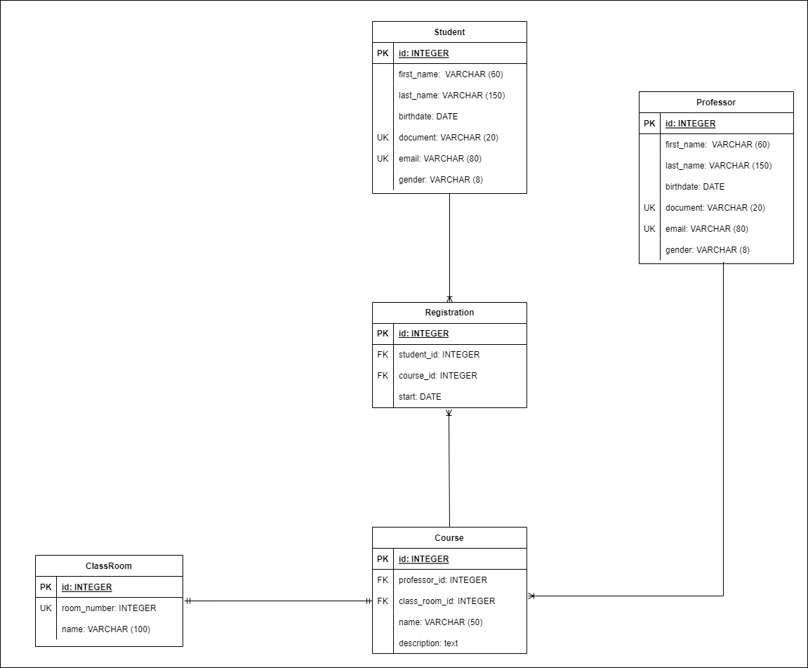

# Project University

## Sobre o Projeto:
Este projeto foi criado apenas para estudo e fixação de conceitos de Banco de Dados, Java, e outros temas relacionados à criação de uma aplicação, portanto, nem sempre as relações das entidades serão como no mundo real.
Sendo assim, optamos por desenhar as entidades da forma como está no diagrama abaixo.
Por exemplo: a relação one to one de classroom e course, que na vida real poderíamos ter uma sala com várias disciplinas
e mais de uma sala para a mesma disciplina, foi feita para que tivéssemos uma relação de cada tipo no projeto.

### Diagrama entidade relacionamento para entendimento do projeto:

